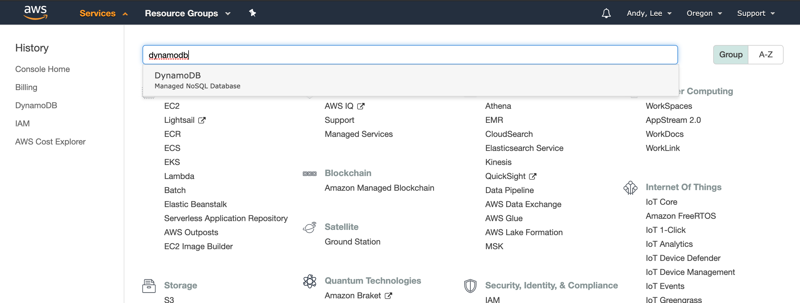
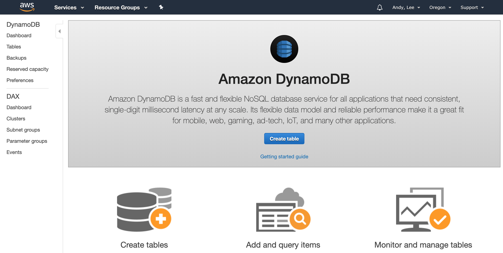

# Dynamo DB

Dynamo DB는 AWS에서 제공하는 No-SQL 데이터베이스 시스템이다.
어떤 상황에서도 한자릿수 millisecond의 성능을 보여준다고 광고하고 있다.
> Amazon DynamoDB is a key-value and document database that delivers single-digit millisecond performance at any scale.)
> by [AWS DynamoDB](https://aws.amazon.com/dynamodb/)

On-Demand 모드와 Provision 모드를 지원하는데, 둘의 가장 큰 차이점은 과금의 기준이다.

On-Demand 모드는 요청 Capacity당 과금이 책정되는 반면, Provision 모드는 미리 설정한 Capacity 기준으로 과금이 된다.
이와 관련하여 Provision 모드는 초당 요청이 미리 설정한 Capacity 를 초과할 경우 해당 요청이 지연되는 Throttle 이 발생된다.

# 일단 써보자

여기서는 AWS에 로그인하여 Dynamo DB 에 테이블 생성, 생성된 테이블에 데이터 추가 / 읽기 / 삭제 등을 CLI를 통해 수행하는 방법을 기록해본다.

## Dynamo DB 첫화면 진입

AWS 계정으로 로그인 하여 Dynamo DB 메뉴를 찾는다.



선택한 후 화면은 이런 화면이 나온다.



## CLI 사용 준비

Command Line 에 아래 내용을 입력해본다.

```zsh
% aws dynamodb describe-endpoints
{
    "Endpoints": [
        {
            "Address": "dynamodb.eu-north-1.amazonaws.com",
            "CachePeriodInMinutes": 1440
        }
    ]
}
```
```zsh
% aws dynamodb list-tables 
{
    "TableNames": []
}
```
여기까지 된다면 테이블을 생성해볼 준비가 되어있는 것이다.
그렇지 않다면 아래 링크를 참고한다.

* [Installing the AWS CLI version 1](https://docs.aws.amazon.com/cli/latest/userguide/install-cliv1.html)
2019년 12월 기준, version 2 는 아직 안정화 되어있지 않다.
* [Configuring the AWS CLI](https://docs.aws.amazon.com/cli/latest/userguide/cli-chap-configure.html#cli-quick-configuration)

## Dynamo DB CLI 실행

모두 [이 문서](https://docs.aws.amazon.com/cli/latest/userguide/cli-services-dynamodb.html)에 설명되어 있는 내용들로 실행해본다.

## 테이블 생성

테이블은 `create-table`명령을 통해 생성한다.

문서에 있는 예제는 `MusicCollection`이라는 이름으로 테이블을 생성하는 예제이다.
`--attribute-definitions`를 통해 저장되는 문서의 속성을 지정하는데, `AttributeName`, `AttributeType` 을 통해 해당 속성의 이름과 타입을 지정한다.
`--key-schema`를 통해 테이블의 인덱스를 지정할 수 있는데, `AttributeName`으로 어떤 속성을 인덱스로 사용할지, `KeyType`으로 인덱스를 어떤 방식으로 사용할지 지정한다.
`--provisioned-throughput`을 통해 Provision 모드로 설정하고 `ReadCapacityUnits`와 `WriteCapacityUnits`를 통해 초당 수행 가능한 요청수를 미리 설정한다.

```zsh
% aws dynamodb create-table \
    --table-name MusicCollection \
    --attribute-definitions AttributeName=Artist,AttributeType=S AttributeName=SongTitle,AttributeType=S \
    --key-schema AttributeName=Artist,KeyType=HASH AttributeName=SongTitle,KeyType=RANGE \
    --provisioned-throughput ReadCapacityUnits=1,WriteCapacityUnits=1
{
    "TableDescription": {
        "AttributeDefinitions": [
            {
                "AttributeName": "Artist",
                "AttributeType": "S"
            },
            {
                "AttributeName": "SongTitle",
                "AttributeType": "S"
            }
        ],
        "TableName": "MusicCollection",
        "KeySchema": [
            {
                "AttributeName": "Artist",
                "KeyType": "HASH"
            },
            {
                "AttributeName": "SongTitle",
                "KeyType": "RANGE"
            }
        ],
        "TableStatus": "CREATING",
        "CreationDateTime": 1576964187.328,
        "ProvisionedThroughput": {
            "NumberOfDecreasesToday": 0,
            "ReadCapacityUnits": 1,
            "WriteCapacityUnits": 1
        },
        "TableSizeBytes": 0,
        "ItemCount": 0,
        "TableArn": "arn:aws:dynamodb:eu-north-1:079570973980:table/MusicCollection",
        "TableId": "b0025823-4614-464e-8180-1fa15abe8eff"
    }
}
```

## 데이터 추가

데이터는 `put-item` 명령어를 통해 추가한다.
여기서는 두번 데이터를 추가하는데, `--return-consumed-capacity` 를 통해 `ConsumedCapacity`를 반환하도록 설정했다.
`--table-name`으로 대상 테이블을 지정하고 `--item`으로 추가할 데이터를 정해준다.

```zsh
% aws dynamodb put-item \
    --table-name MusicCollection \
    --item '{
        "Artist": {"S": "No One You Know"},
        "SongTitle": {"S": "Call Me Today"} ,
        "AlbumTitle": {"S": "Somewhat Famous"}
      }' \
    --return-consumed-capacity TOTAL
{
    "ConsumedCapacity": {
        "TableName": "MusicCollection",
        "CapacityUnits": 1.0
    }
}
```
```zsh
% aws dynamodb put-item \
    --table-name MusicCollection \
    --item '{
        "Artist": {"S": "Acme Band"},
        "SongTitle": {"S": "Happy Day"} ,
        "AlbumTitle": {"S": "Songs About Life"}
      }' \
    --return-consumed-capacity TOTAL
{
    "ConsumedCapacity": {
        "TableName": "MusicCollection",
        "CapacityUnits": 1.0
    }
}
```
전달되는 데이터에는 key로 사용하기로 한 속성들이 반드시 존재해야 한다. 이런 경우 어떤 key 가 문제인지 친절하게 에러메시지에 표시해 준다.
> Missing the key *Artist* in the item
```zsh
% aws dynamodb put-item \
    --table-name MusicCollection \
    --item '{
        "WrongAttributeArtist": {"S": "No One You Know"},
        "WrongAttributeSongTitle": {"S": "Call Me Today"} ,
        "AlbumTitle": {"S": "Somewhat Famous"}
      }' \
    --return-consumed-capacity TOTAL

An error occurred (ValidationException) when calling the PutItem operation: One or more parameter values were invalid: Missing the key Artist in the item
```
```zsh
% aws dynamodb put-item \
    --table-name MusicCollection \
    --item '{
        "Artist": {"S": "No One You Know"},
        "WrongAttributeSongTitle": {"S": "Call Me Today"} ,
        "AlbumTitle": {"S": "Somewhat Famous"}
      }' \
    --return-consumed-capacity TOTAL

An error occurred (ValidationException) when calling the PutItem operation: One or more parameter values were invalid: Missing the key SongTitle in the item
```
하지만 key를 제외한 데이터는 처음 테이블 생성시와 무관하게 자유롭게 추가할 수 있다.
```zsh
% aws dynamodb put-item \
    --table-name MusicCollection \
    --item '{
        "Artist": {"S": "Artist Test"},
        "SongTitle": {"S": "SongTitle Test"} ,
        "IsThisOkay_AlbumTitle": {"S": "AlbumTitle Test with different name"}
      }' \
    --return-consumed-capacity TOTAL
{
    "ConsumedCapacity": {
        "TableName": "MusicCollection",
        "CapacityUnits": 1.0
    }
}
```

## 데이터 읽기

### query

예제에서는 `query` 명령어를 다루고 있다. 이 명령어는 일종의 질의 문법을 제공하는데, [간단한 예제들](https://docs.aws.amazon.com/amazondynamodb/latest/developerguide/SQLtoNoSQL.ReadData.Query.html)을 읽어보면 간단한 질의문을 만들 수 있고, [심화 버전](https://docs.aws.amazon.com/amazondynamodb/latest/developerguide/Query.html)에서는 좀더 자세한 질의 문법을 다룬다.

```zsh
% aws dynamodb query --table-name MusicCollection \
    --key-condition-expression "Artist = :v1 AND SongTitle = :v2" \
    --expression-attribute-values file://expression-attributes.json
{
    "Items": [
        {
            "AlbumTitle": {
                "S": "Somewhat Famous"
            },
            "Artist": {
                "S": "No One You Know"
            },
            "SongTitle": {
                "S": "Call Me Today"
            }
        }
    ],
    "Count": 1,
    "ScannedCount": 1,
    "ConsumedCapacity": null
}
```

### scan

`scan` 은 `query`보다 단순하게 데이터를 읽어오는데, DynamoDB는 1MB 까지만 데이터를 반환해준다. 그 이상을 Scan 하려면 pagination을 통해 데이터를 읽을 수 있다. ([Paginating the Result](https://docs.aws.amazon.com/amazondynamodb/latest/developerguide/Scan.html#Scan.Pagination))

```zsh
% aws dynamodb scan --table-name MusicCollection
{
    "Items": [
        {
            "AlbumTitle": {
                "S": "Somewhat Famous"
            },
            "Artist": {
                "S": "No One You Know"
            },
            "SongTitle": {
                "S": "Call Me Today"
            }
        },
        {
            "AlbumTitle": {
                "S": "Songs About Life"
            },
            "Artist": {
                "S": "Acme Band"
            },
            "SongTitle": {
                "S": "Happy Day"
            }
        },
        {
            "IsThisOkay_AlbumTitle": {
                "S": "AlbumTitle Test with different name"
            },
            "Artist": {
                "S": "Artist Test"
            },
            "SongTitle": {
                "S": "SongTitle Test"
            }
        }
    ],
    "Count": 3,
    "ScannedCount": 3,
    "ConsumedCapacity": null
}
```

### get-item

`get-item`은 `--key`를 통해 일치되는 데이터를 읽어온다.

```zsh
% aws dynamodb get-item --table-name MusicCollection \
    --key file://get-item-key.json
{
    "Item": {
        "AlbumTitle": {
            "S": "Somewhat Famous"
        },
        "Artist": {
            "S": "No One You Know"
        },
        "SongTitle": {
            "S": "Call Me Today"
        }
    }
}
```

## 데이터 삭제

## 테이블 삭제
