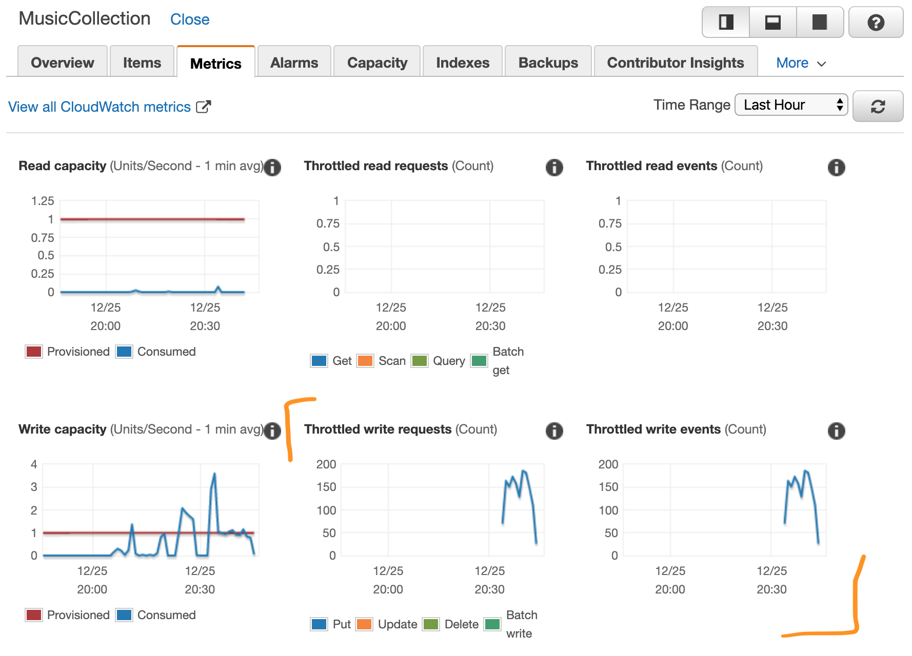

# Dynamo DB

Dynamo DB는 AWS에서 제공하는 No-SQL 데이터베이스 시스템이다.\
어떤 상황에서도 한자릿수 millisecond의 성능을 보여준다고 광고하고 있다.\
> Amazon DynamoDB is a key-value and document database that delivers single-digit millisecond performance at any scale.)
> by [AWS DynamoDB](https://aws.amazon.com/dynamodb/)

On-Demand 모드와 Provision 모드를 지원하는데, 둘의 가장 큰 차이점은 과금의 기준이다.\
On-Demand 모드는 요청 Capacity당 과금이 책정되는 반면, Provision 모드는 미리 설정한 Capacity 기준으로 과금이 된다.\
이와 관련하여 Provision 모드는 초당 요청이 미리 설정한 Capacity 를 초과할 경우 해당 요청이 지연되는 Throttle 이 발생된다.

## 일단 써보자

여기서는 AWS에 로그인하여 Dynamo DB 에 테이블 생성, 생성된 테이블에 데이터 추가 / 읽기 / 삭제 등을 CLI를 통해 수행하는 방법을 기록해본다.

## Dynamo DB 첫화면 진입

AWS 계정으로 로그인 하여 Dynamo DB 메뉴를 찾는다.


선택한 후 화면은 이런 화면이 나온다.


## CLI 사용 준비

Command Line 에 아래 내용을 입력해본다.

```zsh
% aws dynamodb describe-endpoints
{
    "Endpoints": [
        {
            "Address": "dynamodb.eu-north-1.amazonaws.com",
            "CachePeriodInMinutes": 1440
        }
    ]
}
```

```zsh
% aws dynamodb list-tables
{
    "TableNames": []
}
```

여기까지 된다면 테이블을 생성해볼 준비가 되어있는 것이다.\
그렇지 않다면 아래 링크를 참고한다.

* [Installing the AWS CLI version 1](https://docs.aws.amazon.com/cli/latest/userguide/install-cliv1.html)

2019년 12월 기준, version 2 는 아직 안정화 되어있지 않다.

* [Configuring the AWS CLI](https://docs.aws.amazon.com/cli/latest/userguide/cli-chap-configure.html#cli-quick-configuration)

## Dynamo DB CLI 실행

모두 [이 문서](https://docs.aws.amazon.com/cli/latest/userguide/cli-services-dynamodb.html)에 설명되어 있는 내용들로 실행해본다.

## 테이블 생성

테이블은 `create-table`명령을 통해 생성한다.\
문서에 있는 예제는 `MusicCollection`이라는 이름으로 테이블을 생성하는 예제이다.

* `--attribute-definitions`를 통해 저장되는 문서의 속성 지정
  * `AttributeName`, `AttributeType` 을 통해 해당 속성의 이름과 타입 지정
* `--key-schema`를 통해 테이블의 인덱스 지정 가능
  * `AttributeName`으로 어떤 속성을 인덱스로 사용할지, `KeyType`으로 인덱스를 어떤 방식으로 사용할지 지정
* `--provisioned-throughput`을 통해 Provision 모드로 설정
  * `ReadCapacityUnits`와 `WriteCapacityUnits`를 통해 초당 수행 가능한 요청수 미리 설정

```zsh
% aws dynamodb create-table \
    --table-name MusicCollection \
    --attribute-definitions AttributeName=Artist,AttributeType=S AttributeName=SongTitle,AttributeType=S \
    --key-schema AttributeName=Artist,KeyType=HASH AttributeName=SongTitle,KeyType=RANGE \
    --provisioned-throughput ReadCapacityUnits=1,WriteCapacityUnits=1
{
    "TableDescription": {
        "AttributeDefinitions": [
            {
                "AttributeName": "Artist",
                "AttributeType": "S"
            },
            {
                "AttributeName": "SongTitle",
                "AttributeType": "S"
            }
        ],
        "TableName": "MusicCollection",
        "KeySchema": [
            {
                "AttributeName": "Artist",
                "KeyType": "HASH"
            },
            {
                "AttributeName": "SongTitle",
                "KeyType": "RANGE"
            }
        ],
        "TableStatus": "CREATING",
        "CreationDateTime": 1576964187.328,
        "ProvisionedThroughput": {
            "NumberOfDecreasesToday": 0,
            "ReadCapacityUnits": 1,
            "WriteCapacityUnits": 1
        },
        "TableSizeBytes": 0,
        "ItemCount": 0,
        "TableArn": "arn:aws:dynamodb:eu-north-1:079570973980:table/MusicCollection",
        "TableId": "b0025823-4614-464e-8180-1fa15abe8eff"
    }
}
```

## 데이터 추가

데이터는 `put-item` 명령어를 통해 추가한다.\
여기서는 두번 데이터를 추가하는데, `--return-consumed-capacity` 를 통해 `ConsumedCapacity`를 반환하도록 설정했다.

* `--table-name`으로 대상 테이블을 지정
* `--item`으로 추가할 데이터 지정

```zsh
% aws dynamodb put-item \
    --table-name MusicCollection \
    --item '{
        "Artist": {"S": "No One You Know"},
        "SongTitle": {"S": "Call Me Today"} ,
        "AlbumTitle": {"S": "Somewhat Famous"}
      }' \
    --return-consumed-capacity TOTAL
{
    "ConsumedCapacity": {
        "TableName": "MusicCollection",
        "CapacityUnits": 1.0
    }
}
```

```zsh
% aws dynamodb put-item \
    --table-name MusicCollection \
    --item '{
        "Artist": {"S": "Acme Band"},
        "SongTitle": {"S": "Happy Day"} ,
        "AlbumTitle": {"S": "Songs About Life"}
      }' \
    --return-consumed-capacity TOTAL
{
    "ConsumedCapacity": {
        "TableName": "MusicCollection",
        "CapacityUnits": 1.0
    }
}
```

전달되는 데이터에는 key로 사용하기로 한 속성들이 반드시 존재해야 한다.\
이런 경우 어떤 key가 문제인지 친절하게 에러메시지에 표시해 준다.
> Missing the key *Artist* in the item

```zsh
% aws dynamodb put-item \
    --table-name MusicCollection \
    --item '{
        "WrongAttributeArtist": {"S": "No One You Know"},
        "WrongAttributeSongTitle": {"S": "Call Me Today"} ,
        "AlbumTitle": {"S": "Somewhat Famous"}
      }' \
    --return-consumed-capacity TOTAL

An error occurred (ValidationException) when calling the PutItem operation: One or more parameter values were invalid: Missing the key Artist in the item
```

```zsh
% aws dynamodb put-item \
    --table-name MusicCollection \
    --item '{
        "Artist": {"S": "No One You Know"},
        "WrongAttributeSongTitle": {"S": "Call Me Today"} ,
        "AlbumTitle": {"S": "Somewhat Famous"}
      }' \
    --return-consumed-capacity TOTAL

An error occurred (ValidationException) when calling the PutItem operation: One or more parameter values were invalid: Missing the key SongTitle in the item
```

하지만 key를 제외한 데이터는 처음 테이블 생성시와 무관하게 자유롭게 추가할 수 있다.

```zsh
% aws dynamodb put-item \
    --table-name MusicCollection \
    --item '{
        "Artist": {"S": "Artist Test"},
        "SongTitle": {"S": "SongTitle Test"} ,
        "IsThisOkay_AlbumTitle": {"S": "AlbumTitle Test with different name"}
      }' \
    --return-consumed-capacity TOTAL
{
    "ConsumedCapacity": {
        "TableName": "MusicCollection",
        "CapacityUnits": 1.0
    }
}
```

## 데이터 읽기

### query

예제에서는 `query` 명령어를 다루고 있다. \
이 명령어는 일종의 질의 문법을 제공하는데, [예제](https://docs.aws.amazon.com/amazondynamodb/latest/developerguide/SQLtoNoSQL.ReadData.Query.html)들을 읽어보면 간단한 질의문을 만들 수 있고, [심화 버전](https://docs.aws.amazon.com/amazondynamodb/latest/developerguide/Query.html)에서는 좀더 자세한 질의 문법을 다룬다.\
직접 json 내용을 입력하는 대신, `expression-attributes.json` 파일을 통해 값을 CLI로 전달하고 있다.

```json
// expression-attributes.json
{
  ":v1": {"S": "No One You Know"},
  ":v2": {"S": "Call Me Today"}
}
```

```zsh
% aws dynamodb query --table-name MusicCollection \
    --key-condition-expression "Artist = :v1 AND SongTitle = :v2" \
    --expression-attribute-values file://expression-attributes.json \
    --return-consumed-capacity TOTAL
{
    "Items": [
        {
            "AlbumTitle": {
                "S": "Somewhat Famous"
            },
            "Artist": {
                "S": "No One You Know"
            },
            "SongTitle": {
                "S": "Call Me Today"
            }
        }
    ],
    "Count": 1,
    "ScannedCount": 1,
    "ConsumedCapacity": {
        "TableName": "MusicCollection",
        "CapacityUnits": 0.5
    }
}
```

### scan

`scan` 은 `query`보다 단순하게 데이터를 읽어오는데, DynamoDB는 1MB 까지만 데이터를 반환해준다.\
그 이상을 Scan 하려면 pagination을 통해 데이터를 읽을 수 있다. ([Paginating the Result](https://docs.aws.amazon.com/amazondynamodb/latest/developerguide/Scan.html#Scan.Pagination))

```zsh
% aws dynamodb scan --table-name MusicCollection \
    --return-consumed-capacity TOTAL
{
    "Items": [
        {
            "AlbumTitle": {
                "S": "Somewhat Famous"
            },
            "Artist": {
                "S": "No One You Know"
            },
            "SongTitle": {
                "S": "Call Me Today"
            }
        },
        {
            "AlbumTitle": {
                "S": "Songs About Life"
            },
            "Artist": {
                "S": "Acme Band"
            },
            "SongTitle": {
                "S": "Happy Day"
            }
        },
        {
            "IsThisOkay_AlbumTitle": {
                "S": "AlbumTitle Test with different name"
            },
            "Artist": {
                "S": "Artist Test"
            },
            "SongTitle": {
                "S": "SongTitle Test"
            }
        }
    ],
    "Count": 3,
    "ScannedCount": 3,
    "ConsumedCapacity": {
        "TableName": "MusicCollection",
        "CapacityUnits": 0.5
    }
}
```

### get-item

`get-item`은 `--key`를 통해 key가 일치하는 데이터를 가져온다.

```json
// get-item-key.json
{
  "Artist": {"S": "No One You Know"},
  "SongTitle": {"S": "Call Me Today"}
}
```

```zsh
% aws dynamodb get-item --table-name MusicCollection \
    --key file://get-item-key.json \
    --return-consumed-capacity TOTAL
{
    "Item": {
        "AlbumTitle": {
            "S": "Somewhat Famous"
        },
        "Artist": {
            "S": "No One You Know"
        },
        "SongTitle": {
            "S": "Call Me Today"
        }
    },
    "ConsumedCapacity": {
        "TableName": "MusicCollection",
        "CapacityUnits": 0.5
    }
}
```

## 데이터 삭제

`delete-item` 명령어로 `--key`와 일치하는 데이터를 삭제할 수 있다. \
여기서도 파일을 통해 item을 지정해본다.

```json
// delete-item-key.json
{
  "Artist": {"S": "Acme Band"},
  "SongTitle": {"S": "Happy Day"}
}
```

```zsh
% aws dynamodb delete-item --table-name MusicCollection \
    --key file://delete-item-key.json \
    --return-consumed-capacity TOTAL
{
    "ConsumedCapacity": {
        "TableName": "MusicCollection",
        "CapacityUnits": 1.0
    }
}
```

## Throttle 확인

이미 작성된 `looptest.sh` 파일을 통해 throttle을 강제로 발생시켜볼 수 있다.

```zsh
bash ./looptest.sh {1001..1100} &
bash ./looptest.sh {1101..1200} &
bash ./looptest.sh {1201..1300} &
bash ./looptest.sh {1301..1400} &
bash ./looptest.sh {1401..1500} &
bash ./looptest.sh {1501..1600} &
bash ./looptest.sh {1601..1700} &
bash ./looptest.sh {1701..1800} &
bash ./looptest.sh {1801..1900} &
bash ./looptest.sh {1901..2000} &
```

### 실행중인 `looptest.sh`

```zsh
...

done -  1798
begin -  1799
{
    "ConsumedCapacity": {
        "TableName": "MusicCollection",
        "CapacityUnits": 1.0
    }
}
{
    "ConsumedCapacity": {
        "TableName": "MusicCollection",
        "CapacityUnits": 1.0
    }
}
done -  1496
begin -  1497
done -  1695
begin -  1696
{
    "ConsumedCapacity": {
        "TableName": "MusicCollection",
        "CapacityUnits": 1.0
    }
}
done -  1396
begin -  1397
{
    "ConsumedCapacity": {
        "TableName": "MusicCollection",
        "CapacityUnits": 1.0
    }
}
done -  1799

...
```

### AWS Console의 Metrics 화면



## 테이블 삭제

`delete-table`을 통해 테이블을 삭제할 수 있다.

```zsh
% aws dynamodb delete-table --table-name MusicCollection
{
    "TableDescription": {
        "TableName": "MusicCollection",
        "TableStatus": "DELETING",
        "ProvisionedThroughput": {
            "NumberOfDecreasesToday": 0,
            "ReadCapacityUnits": 1,
            "WriteCapacityUnits": 1
        },
        "TableSizeBytes": 0,
        "ItemCount": 0,
        "TableArn": "arn:aws:dynamodb:eu-north-1:079570973980:table/MusicCollection",
        "TableId": "b0025823-4614-464e-8180-1fa15abe8eff"
    }
}
```

### 테이블 삭제 여부 확인

```zsh
% aws dynamodb list-tables
{
    "TableNames": []
}
```

AWS의 대표적인 서비스인 DynamoDB를 CLI를 통해 간단히 이용해보았다.\
AWS의 서비스들은 REST API를 지원하고, AWS SDK가 해당 API의 호출을 감싸는 구조로 설계되어 있다.\
따라서 CLI에서 어떤 기능을 지원하는지 알면, 특정 언어에서 어떤 키워드를 통해 API호출을 구성하고 있을지 예측하기 좋다.

## References

[AWS CLI Reference](https://docs.aws.amazon.com/cli/latest/reference/dynamodb/index.html#cli-aws-dynamodb)\
[Amazon DynamoDB Developer Guide](https://docs.aws.amazon.com/amazondynamodb/latest/developerguide/Introduction.html)
