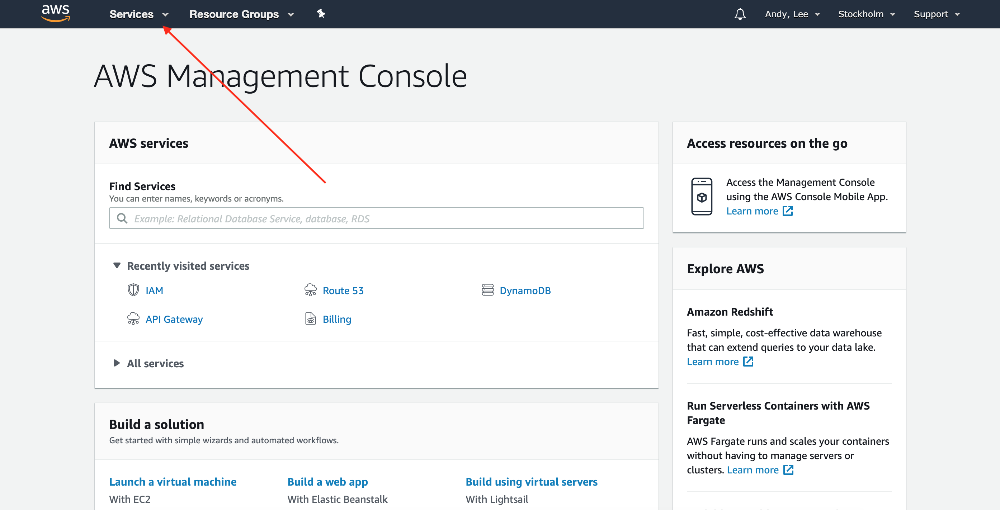
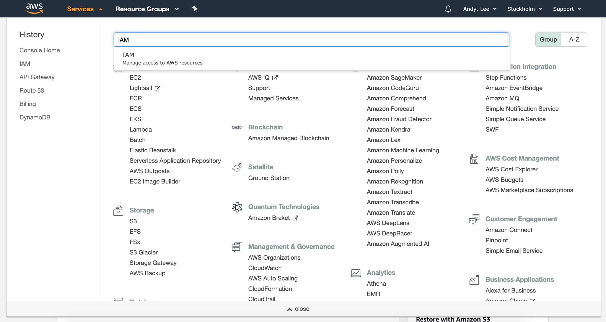
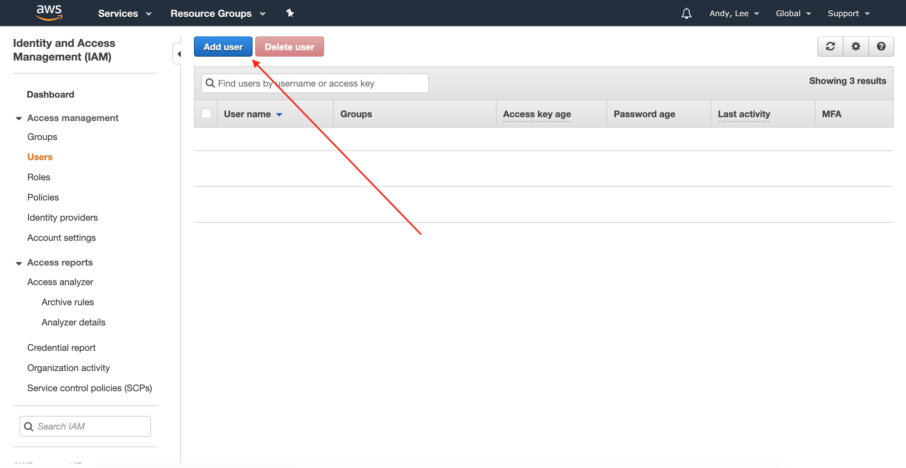
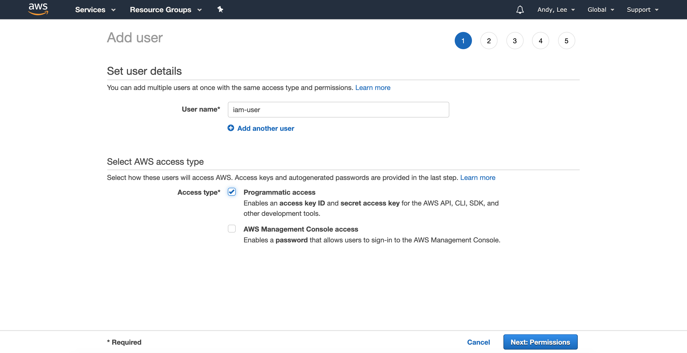
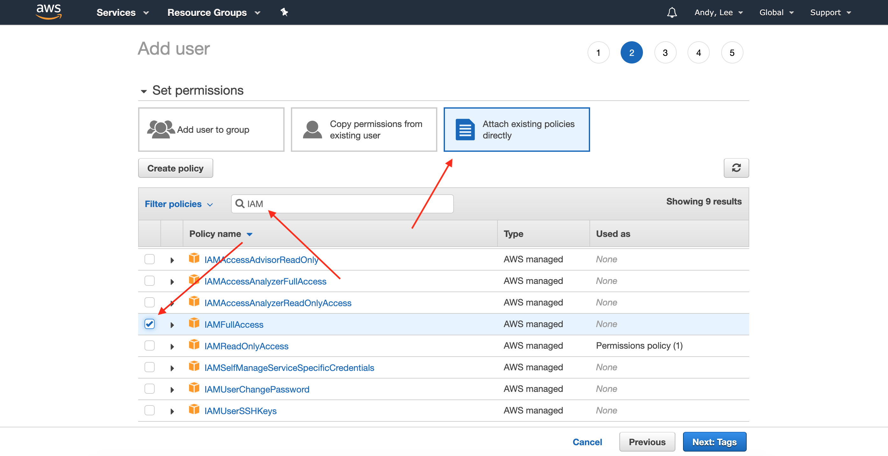
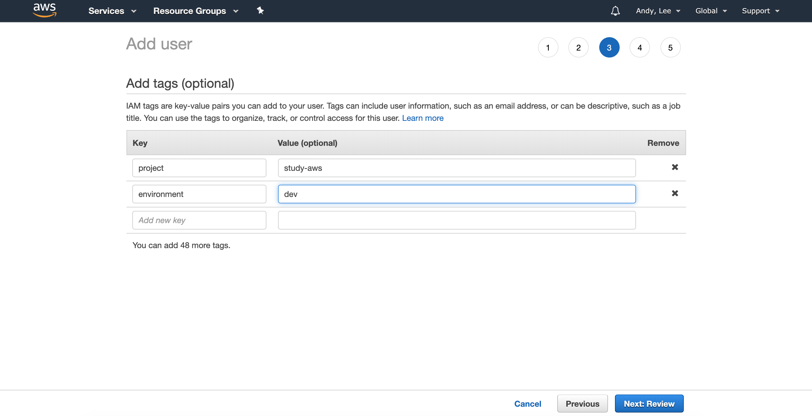
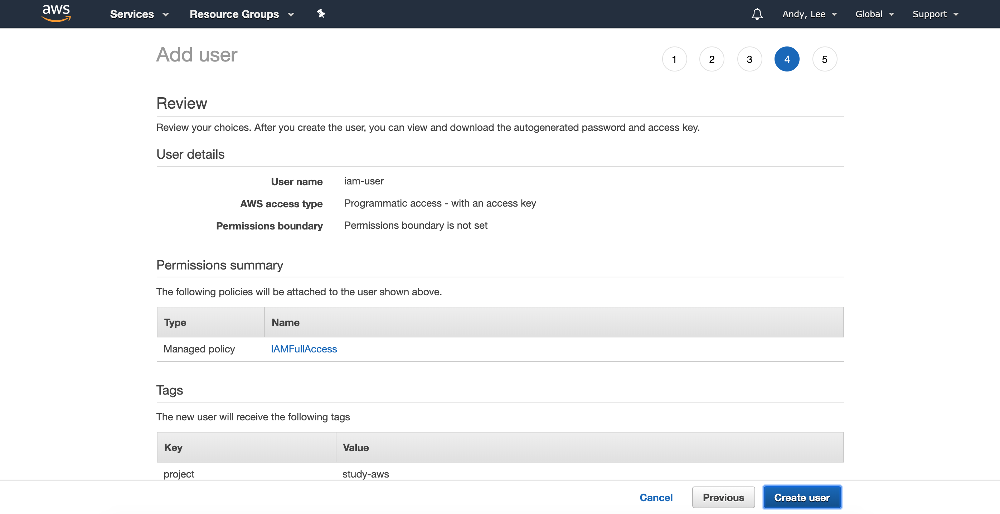
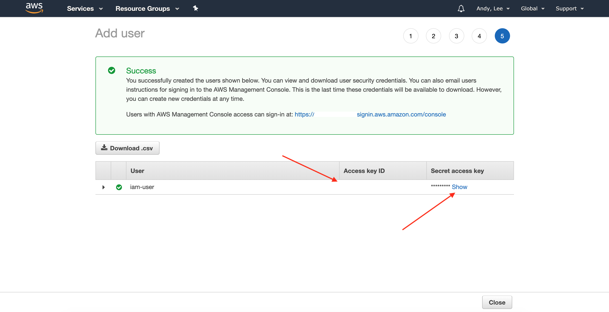
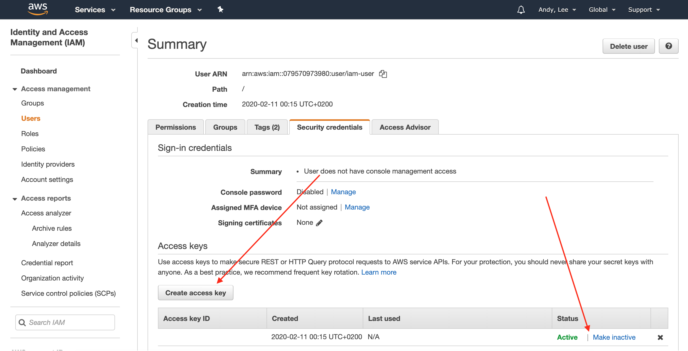

# AWS CLI 시작하기

처음 AWS를 시작할 때, AWS Console을 이용해 리소스를 만들곤 했다.\
그러다보니 확장을 할 때에도, 다른 사람에게 내용을 전달할 때에도 화면을 보여줘야 하는 번거로움이 있었다.

여기서는 최대한 AWS CLI를 많이 이용하여 명령어로 쉽게 재현 가능한 환경을 만들어 볼 예정이다.\
소위 말하는 [Infrastrucure as Code](https://en.wikipedia.org/wiki/Infrastructure_as_code)를 이용하여 간단하게 훨씬 간편하게 진행할 수 있지만,\
AWS CLI를 이용해 보면서 좀더 상세하게 리소스의 구성을 확인해보고 싶었다.

이 문서를 통해 아래 과정을 따라가 볼 예정이다.

- [AWS CLI 시작하기](#aws-cli-%ec%8b%9c%ec%9e%91%ed%95%98%ea%b8%b0)
  - [AWS Console - 계정 생성](#aws-console---%ea%b3%84%ec%a0%95-%ec%83%9d%ec%84%b1)
  - [AWS Console - IAM 사용자 생성](#aws-console---iam-%ec%82%ac%ec%9a%a9%ec%9e%90-%ec%83%9d%ec%84%b1)
    - [IAM 화면으로 이동](#iam-%ed%99%94%eb%a9%b4%ec%9c%bc%eb%a1%9c-%ec%9d%b4%eb%8f%99)
    - [IAM User 추가](#iam-user-%ec%b6%94%ea%b0%80)
  - [Command Line - CLI 사용 준비](#command-line---cli-%ec%82%ac%ec%9a%a9-%ec%a4%80%eb%b9%84)

## AWS Console - 계정 생성

계정 생성시에 지불수단과 연락처 등의 개인정보를 입력하게 되어있으니, 준비하고 시작하자.

계정을 생성하는 법은 이 동영상에 잘 설명되어 있다. \
[How do I create and activate a new Amazon Web Services account?](https://www.youtube.com/watch?v=RbLbDO0CtrM)

## AWS Console - IAM 사용자 생성

AWS CLI를 이용하기 위해서는 Programmatic Access가 가능한 AWS User가 필요하다.

IAM 관리 권한을 갖고 있는 계정을 만든 후, 다른 계정을 역시 AWS CLI로 만들어서 사용할 예정이다.

### IAM 화면으로 이동

로그인 후에는 아래와 같은 화면이 나오는데, 여기서 Service 선택 화면을 연다.



검색창에 IAM을 입력하면 바로 이동할 수 있다.



### IAM User 추가

IAM Dashboard에서 좌측의 `Users` 메뉴를 통해 사용자 화면으로 이동할 수 있다.\
이후 `Add User` 버튼을 이용해 사용자를 추가할 수 있다.



`User name` 에 계정 이름을 입력하고 `Access type`에 `Programmatic access`를 체크하여 AWS CLI를 이용할 수 있도록 준비한다.



해당 계정에 `IAMFullAccess` 정책을 적용한다.\
이 내용은 현재 생성하는 User 가 IAM 관련 모든 권한을 가진다는 의미이다.



(Optional) 해당 계정을 간략히 나타낼 수 있는 Tag를 입력한다.



지금까지 입력한 내용을 검토한다.



Programmatic Access가 가능한 계정이 생성되었다.\
여기에 표시된 Access key ID와 Secret access key는 한번만 볼 수 있고,\
분실하더라도 갱신하여 사용할 수 있지만, 원활한 진행을 위해 잠시 창을 닫지 말자.



이후 갱신이 필요한 경우 IAM의 Users -> 해당 계정정보 화면에서 갱신이 가능하다.



## Command Line - CLI 사용 준비

IAM 권한을 가진 User가 AWS CLI를 통해 AWS에 접근할 수 있도록 준비해본다.\
위 화면의 Access Key ID, Secret Access Key를 `aws configure`를 통해 입력한다.

```zsh
% aws configure --profile iam-user
AWS Access Key ID [None]: XXXXXXXXXXXXXXXXXXXX
AWS Secret Access Key [None]: XxXxXxXxXxXxXxXxXxXxXxXxXxXxXxXxXxXxXxXx
Default region name [None]: eu-north-1
Default output format [None]: <enter>
```

IAM 명령어로 테스트 해본다.

```zsh
% aws iam list-users --profile iam-user
{
    "Users":[
        ...
    ]
}
```

권한이 없는 리소스에 접근하면 아래와 같은 에러메시지를 볼 수 있다.

```zsh
% aws s3 ls --profile iam-user

An error occurred (AccessDenied) when calling the ListBuckets operation: Access Denied
```

이제 우리가 설정한 `iam-user`라는 Profile을 이용해 다른 작업을 해볼 준비가 됐다.

[IAM 문서 바로가기](../iam/README.md)
